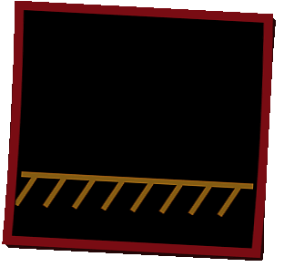

# Ground Zero NestJS Open Source Project

  

### About Ground Zero NestJS :
- "Ground Zero NestJS", aka *GZ-Nest*, is an Open Source project that enables developers to quickly start a new NestJS project and then, as the project grows, easily plug-&-play new features into it.

### How it works in general :
- In general *GZ-Nest* for backend projects is analogous to what a PC-building-kit is for a PC building project.

- Just as a PC-building-kit has a motherboard and different plug-&-play components such as graphics , sounds into it, so does *GZ-Nest* which has a base code component as a "mother-board" and different independent code-components (for auth, db, ...) that plug-&-play into the base code.

### How it works in practice :
- In practice *GZ-Nest* consists of "code-units", where one of the code units is the "motherboard" (in the analogy), this unit is named "unit-base".

- The features of the unit-base are the minimum features needed for a production ready backend, this includes a Logger, OpenAPI docs (swagger), CI/CD pipeline to GitHub Actions and whatever is needed as the basic infrastructure.

- All other units are developed to integrate with unit-base, they are independent of one another and only dependent on the unit-base.

- Each unit is a feature, for example an authentication feature with jwt access & refresh tokens is *unit-auth-jwt*, or a feature with prisma mysql is *unit-dtbs-prsm-msql*. 

 

### *GZ-Nest* enables developers :

- To have ready made source + test code of components for their own projects.

- To contribute to an OpenSource project, by adding components they create from scratch or by fixing & upgrading existing components.

- To learn a new skill, since each unit in *GZ-Nest* is not only a component to build backends, but also a skill that can be learned. 
  - *Examples of skills:*
     1. Using Typeorm with Postgress
    2. Using JWT authentication with refresh tokens.

